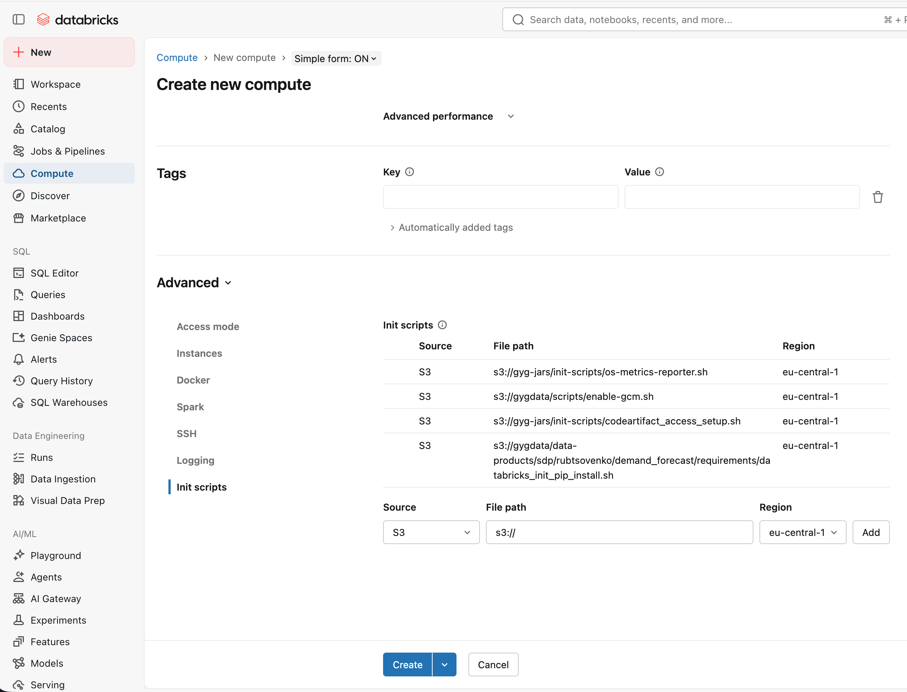

# Load config

```
aws_login_dwh

venv_activate
python
```

```
from demand_forecast.src.env import ROOT_DIR, CONFIGS_DIR
from demand_forecast.src.config.main import DatasetConfig, read_config_from_yaml_file, init_config_from_yaml_file

config_fn = 'experiment_1.yaml'
config = init_config_from_yaml_file(config_fn)

config.print()
```

Iterate over nested elements of the struct:
```
for field_name, value in config.paths.data_files:
    print(field_name, value)
```


# Copy data locally

```
aws_login_dwh

venv_activate
python

export PYTHONPATH=$(pwd)
python demand_forecast/scripts/download_data.py --config experiment_1.yaml
```

# Launch Jupyter

```
pyenv activate jupyter-mcp

PYTHONPATH=$(pwd) jupyter lab --port 8001 --IdentityProvider.token jupyter-mcp
```

Troubleshooting
```
curl -s http://localhost:8001/api/kernels?token=jupyter-mcp | python3 -m json.tool | grep -A3 '"research-db"'

# I need to comment out by db token, figure it out why, probably I have too many of them, otherwise VS code can't see db spark context when executes notebook's cells.
#export DATABRICKS_TOKEN
```

Instructions for claude:
```
work in the notebook: path/to/notebook.ipynb

use the kernel research-db

When you execute cells, report in the command line the progress, which cell you are currenlty executing

show the changes that you want to apply and ask me if you edit the cell with some existing code

by default: write code in new cells

first insert the code in the cell, then with another command run it
first write query in the colsole, then add it to the cell in the notebook

when I ask data exploration questions or writing queries requests, don't look for the tables locally, use databricks mcp and github for the source tables to decide which tables to use
```

## Create DB Cluster

The demand forecast has package dependencies that must be installed on the cluster.
Use the bash script for the cluster init stage to installed once and have in all notebook sessions.

1) Copy scripts to s3
```
aws_login_dwh

aws s3 cp --recursive \
    demand_forecast/scripts/db_cluster_requirements/ \
    s3://gygdata/data-products/sdp/rubtsovenko/demand_forecast/requirements/

```

2) Create a cluster and specify init step pointing to the uploaded bash script

